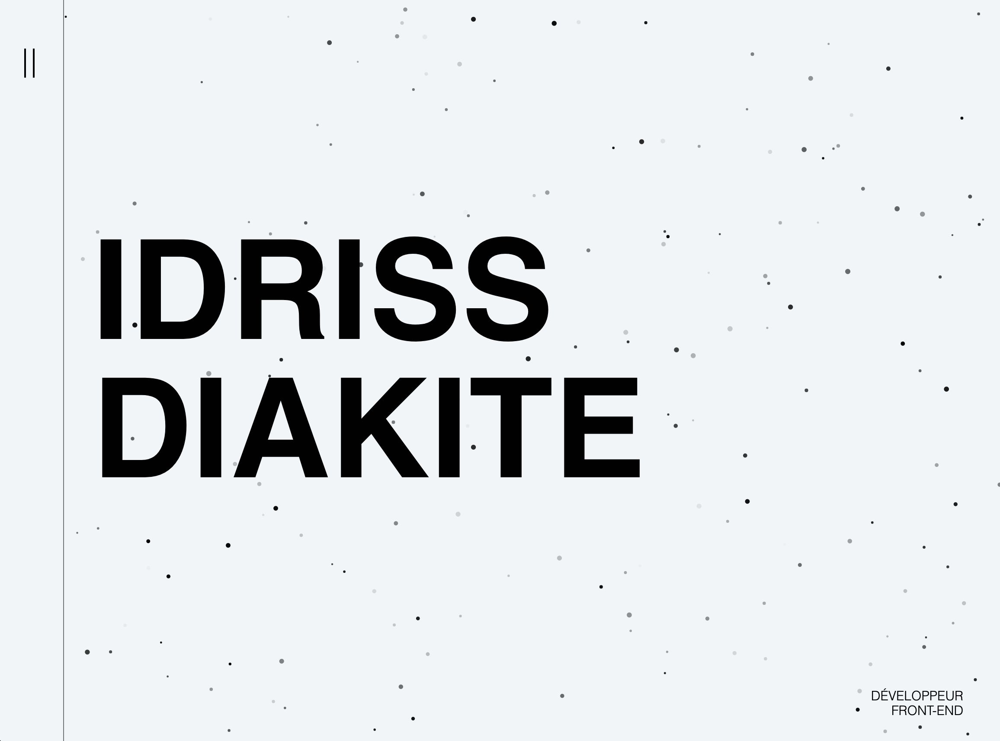

# Portfolio (React + Particles.js + Framer Motion + Netlify)

## ✨ V2

Ce portfolio a été développé initialemment en 2021 juste à la suite de ma formation de développeur full stack. Préférant me consacrer pleinement à la refonte de mon site de musique ilovethistrack.com (headless + webgl), je n'ai effectué que très peu de modifications pour cette [v2](https://github.com/idrissdiakite/portfolio-react/tree/v2), il va donc sans dire que ce projet ne reflète pas forcément l'étandu de mes compétences techniques actuelles. 

Pour cette v2, j'ai gardé la même base (en terme de mise en forme) que la v1, j'ai surtout revu l'architecture complète du projet: création de nouveaux components, concaténation du code et du css.. ainsi que l'intégration de quelques légères animations via Framer Motion.

## 📍 V1

Portfolio réalisé avec React et SCSS (pour la mise en forme).
- mise en place d'un preloader (gif) avant d'afficher la homepage
- utilisation de la bibliothèque "particles" pour créer un background dynamique sur la homepage
- utilisation de la bibliothèque "framer motion" afin de gérer les transitions entre les pages et l'apparition des composants
- ajout d'un cursor personnalisé sur la homepage
- création de plusieurs composants (cf. "Menu", "Loader", "Header"...) afin de ne pas surcharger les pages
- création de tableaux d'objets et utilisation de la méthode ".map" sur ces derniers afin d'éviter la redondance de code
- utilisation de différents hooks React (useState, createContext, useContext..)
- intégration d'icônes SVG via la bibliothèque "react-icons"
- ajout d'un favicon personnalisé
- gestion du responsive mobile, tablette et grand écran
- mise en ligne du projet sur Netlify

## 🚀 Installation

1. git clone ou télécharger le projet
2. à la racine du projet:
- **npm i** pour installer les dépendances (nodes modules)
- **npm start** pour lancer le projet

## 💫 Live

[https://idrissdiakite.netlify.app](https://idrissdiakite.netlify.app)
